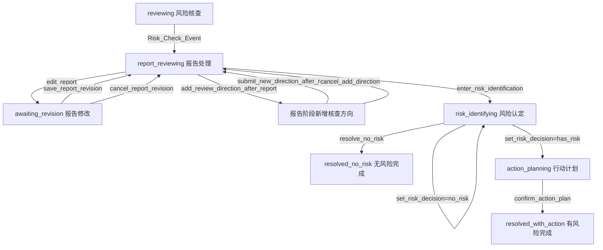

# agent-ui-vue

`agent-ui-vue` 是一个基于 `Vue 3 + Element Plus + TypeScript + Python` 的 **Agent-driven UI Runtime Engine** 示例项目。

当前主场景是：**预警核查工作台**。

这个项目不是传统的“前端组件内部直接维护业务状态”的实现方式，而是把页面演化拆成一条清晰链路：

```text
页面初始化 / 用户操作
-> WorkflowEvent
-> Runtime
-> Patch Planner
-> PatchOperation[]
-> applyPatches()
-> WorkflowEnvelope
-> Renderer
-> UI 更新
```

核心原则：

- UI 由 `WorkflowEnvelope` 和 JSON Schema 驱动
- 组件只负责发出 `WorkflowEvent`
- 业务真实状态保存在 `WorkflowContext`
- 所有 UI 和业务状态更新都通过 `PatchOperation[]`
- `allowedEvents` 控制当前阶段允许哪些交互
- 事件契约同时在前端和 Python patch 服务入口校验

## 当前业务流程

预警核查工作台围绕三阶段业务模式展开：

```text
风险核查 -> 风险认定 -> 后续行动计划制定
```

当前已覆盖的主流程：

1. 页面启动后自动触发 `init_event`
2. Python patch 服务回填预警详情和核查方向
3. 用户勾选或新增核查方向
4. 执行核查并生成核查报告
5. 报告阶段可修改报告、补充核查方向或进入风险认定
6. 风险认定可选择无风险或有风险
7. 无风险路径：解警并完成任务
8. 有风险路径：进入行动计划，确认后完成任务

## 阶段流转



主要 `WorkflowState`：

| 状态 | 含义 |
| --- | --- |
| `reviewing` | 风险核查阶段 |
| `report_reviewing` | 核查报告后续处理阶段 |
| `awaiting_revision` | 核查报告修改子流程 |
| `risk_identifying` | 风险认定阶段 |
| `action_planning` | 后续行动计划制定阶段 |
| `resolved_no_risk` | 无风险解警完成 |
| `resolved_with_action` | 有风险且行动计划确认完成 |

## 当前能力

- `WorkflowEnvelope` 驱动整页渲染
- Page / Section / Component 分层 renderer
- widget registry 映射具体组件
- `useWorkflowRuntime()` 统一承接事件、planner 调用和 patch 应用
- 前端 `applyPatches()` 作为唯一状态变更入口
- Python HTTP patch 服务
- Python patch builders 负责业务事件到 patch 的转换
- 前后端事件契约校验
- `WorkflowContext` 保存业务真实状态
- `allowedEvents` 按阶段动态切换
- 报告修改正式子流程
- patch builder 单测和阶段流转契约测试

## 技术栈

- Vue 3
- TypeScript
- Element Plus
- Vite
- Python 标准库 HTTP 服务
- Python `unittest`

## 快速开始

### 安装依赖

```bash
npm install
```

### 启动 Python patch 服务

```bash
cd python
python patch_service.py
```

健康检查：

```bash
curl http://127.0.0.1:8000/health
```

### 启动前端

另开一个终端：

```bash
npm run dev
```

默认访问：

[http://localhost:5173/](http://localhost:5173/)

### 运行测试

```bash
python -m unittest discover -s python/tests -p "test_*.py"
```

当前 Python 回归包含：

- patch builder 单测
- 阶段流转契约测试
- 非法事件契约测试

### 编译应用 DSL

当前已提供第一版 CLI 编译/组装工具，可将业务配置 DSL 编译到 `generated/` 目录：

```bash
python tools/app_compiler.py apps/warning-review.app.yaml
```

默认输出：

```text
generated/warning_review_workbench/
```

生成产物暂不自动覆盖或接入当前 runtime，主要作为下一阶段代码生成和装配链路的稳定输出契约。

### 前端类型检查 / 构建

```bash
npm run build
```

注意：当前仓库仍存在若干历史 TypeScript 类型问题，主要位于：

- `src/agent/MockPatchPlannerModel.ts`
- `src/components/widgets/DataTableWidget.vue`
- `src/components/widgets/KeyValueWidget.vue`

这些问题和当前 Python 流程回归不是同一层面的失败。

## 本地联调结构

```text
浏览器
-> Vite 前端 dev server
-> /api/patch-plan
-> Vite proxy
-> Python patch service :8000
-> agent_patch_builders
-> PatchPlanningOutput
-> 前端 applyPatches()
-> Renderer 更新 UI
```

相关文件：

| 文件 | 作用 |
| --- | --- |
| `src/App.vue` | 页面入口，挂载后触发 `init_event` |
| `src/composables/useWorkflowRuntime.ts` | Runtime 中枢 |
| `src/types/workflow.ts` | 核心协议类型 |
| `src/workflow/definition.ts` | 前端事件契约 |
| `src/utils/patch.ts` | 前端 patch engine |
| `src/agent/HttpPatchPlannerModel.ts` | 前端 HTTP planner model |
| `python/patch_service.py` | Python patch 服务入口 |
| `python/agent_patch_builders/workflow_definition.py` | Python 事件契约和 allowedEvents 推导 |
| `python/agent_patch_builders/workflow_action_builders.py` | 业务事件 patch builders |
| `python/agent_patch_builders/section_builders.py` | UI section builders |
| `python/tests/test_patch_builders.py` | patch builder 单测 |
| `python/tests/test_workflow_transition_contracts.py` | 阶段流转契约测试 |

## 核心协议

### WorkflowEnvelope

`WorkflowEnvelope` 是当前 UI 和业务流程的运行时快照。

```ts
interface WorkflowEnvelope {
  id: string;
  version: string;
  state: WorkflowState;
  page: UIPageSchema;
  messages: WorkflowMessage[];
  allowedEvents: string[];
  riskSummary: WorkflowRiskSummary;
  context: WorkflowContext;
}
```

### WorkflowContext

`WorkflowContext` 保存业务真实状态，避免从 UI section 反查业务数据。

```ts
interface WorkflowContext {
  warningDetailItems: Array<{ label: string; value: string }>;
  reviewDirections: ChecklistItem[];
  reportText?: string;
  riskDecision?: "has_risk" | "no_risk";
  riskReason: string;
  actionItems: ChecklistItem[];
}
```

### PatchOperation

当前支持：

- `set_state`
- `set_context`
- `replace_section`
- `append_section`
- `remove_section`
- `prepend_message`
- `set_allowed_events`
- `set_risk_summary`

## allowedEvents 生命周期

### 初始壳子

`src/mock/initialEnvelope.ts` 初始只开放：

```ts
allowedEvents: ["init_event"]
```

### 初始化完成后

```text
toggle_check
add_checklist_item
Risk_Check_Event
open_detail
```

### 报告处理阶段

```text
edit_report
add_review_direction_after_report
enter_risk_identification
open_detail
```

### 报告修改子流程

```text
save_report_revision
cancel_report_revision
open_detail
```

### 报告阶段新增核查方向

```text
submit_new_direction_after_report
cancel_add_direction
open_detail
```

### 风险认定阶段

```text
set_risk_decision
update_risk_reason
resolve_no_risk
confirm_risk_identification
open_detail
```

### 行动计划阶段

```text
toggle_action_item
add_action_item
confirm_action_plan
open_detail
```

当选择“有风险”并自动展开行动计划时，为了允许继续调整风险认定说明，当前行动计划阶段会额外保留：

```text
set_risk_decision
update_risk_reason
resolve_no_risk
```

### 任务完成后

```text
open_detail
```

## 当前页面结构

| sectionId | 说明 | 主要 widget |
| --- | --- | --- |
| `sec_overview` | 预警情况详情 | `key_value` |
| `sec_table_demo` | 关联台账 | `data_table` |
| `sec_main_review` | 核查方向 | `checklist`、`text_input`、`button_group` |
| `sec_review_report` | 核查报告 | `text` |
| `sec_report_actions` | 报告后续处理 | `button_group` |
| `sec_report_edit` | 修改核查报告 | `text_input` textarea、`button_group` |
| `sec_add_review_direction` | 报告阶段新增核查方向 | `text_input`、`button_group` |
| `sec_risk_identification` | 风险认定 | `key_value`、`button_group`、`text_input` |
| `sec_action_plan` | 行动计划 | `checklist`、`text_input`、`button_group` |
| `sec_resolution_result_no_risk` | 无风险结果 | `result_summary` |
| `sec_resolution_result_with_action` | 有风险行动计划结果 | `result_summary` |

## 目录结构

```text
src/
  App.vue
  main.ts
  agent/
  components/
    layout/
    renderer/
    widgets/
  composables/
  mock/
  types/
  utils/
  workflow/

python/
  patch_service.py
  agent_patch_builders/
  tests/

docs/
  warning-review-workbench-dev-guide.md
  Agent.md
  skills/
```

## 开发新业务动作的步骤

以新增一个业务动作或子流程为例，建议按这个顺序做：

1. 在 `src/workflow/definition.ts` 增加前端事件契约
2. 在 `python/agent_patch_builders/workflow_definition.py` 增加 Python 事件契约
3. 如有新阶段，补充 `allowed_events_for_state()`
4. 如需新 UI，先在 `section_builders.py` 增加 section builder
5. 在 `workflow_action_builders.py` 增加 patch builder
6. 在 `patch_service.py` 接入事件分支
7. 必要时扩展 `WorkflowContext`
8. 补充 `test_patch_builders.py`
9. 补充或更新 `test_workflow_transition_contracts.py`
10. 运行 Python 回归测试

开发约束：

- 不要在 widget 内直接修改业务状态
- 不要让 UI section 成为业务状态唯一来源
- 不要在 `initialEnvelope.ts` 写入真实业务数据
- 新增事件必须同步前后端事件契约
- 新增阶段必须明确 `allowedEvents`
- 新增流程必须补阶段流转契约测试

## 推荐回归路径

每次修改状态、事件、section、context 或 patch builder 后，至少验证：

1. 页面加载后是否自动触发 `init_event`
2. 预警情况详情是否回填
3. 核查方向是否正确显示
4. 新增核查方向是否回写到 context 和 UI
5. 执行核查后是否生成报告和报告后续处理按钮
6. 修改核查报告是否进入 `awaiting_revision`
7. 保存报告是否刷新报告正文并回到 `report_reviewing`
8. 取消报告修改是否保留原报告
9. 报告阶段新增核查方向是否刷新报告
10. 进入风险认定后是否只开放风险认定相关事件
11. 无风险路径是否完成解警
12. 有风险路径是否进入行动计划
13. 行动计划新增、勾选、确认是否闭环
14. 完成后是否只保留 `open_detail`

## 进一步阅读

- [应用开发及配置说明书](docs/warning-review-workbench-dev-guide.md)
- [Agent 说明](docs/Agent.md)
- [Workflow Patch Generation Skill](docs/skills/workflow-patch-generation/SKILL.md)
- [交接说明](HANDOVER.md)

说明：`docs/Agent.md` 和 `HANDOVER.md` 当前仍可能存在历史编码污染，后续建议统一重写为 UTF-8 中文版。
