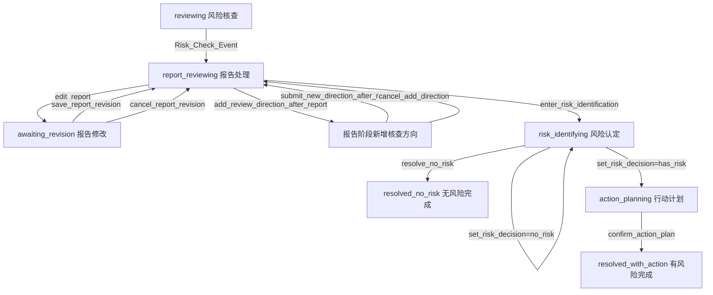

# 预警核查工作台应用开发及配置说明书

本文以当前项目中的“预警核查工作台”为例，说明如何基于 Agent-driven UI Runtime Engine 开发一个三阶段业务应用：

```text
风险核查 -> 风险认定 -> 后续行动计划制定
```

本文面向后续维护者和应用开发者。重点不是 Vue 组件怎么写，而是说明如何让界面设计、事件设计、事件处理程序三者保持一致。

## 1. 核心开发模型

本项目不建议在组件内部直接维护业务状态。推荐开发模型如下：

```text
页面初始化 / 用户操作
-> WorkflowEvent
-> Runtime
-> Patch Planner
-> PatchOperation[]
-> applyPatches()
-> WorkflowEnvelope
-> Renderer
-> UI 更新
```

开发时请始终围绕四个对象建模：

| 对象 | 作用 | 当前主要文件 |
| --- | --- | --- |
| `WorkflowState` | 表示当前业务阶段 | `src/types/workflow.ts` |
| `WorkflowEvent` | 表示用户或系统触发的业务动作 | `src/workflow/definition.ts`、`python/agent_patch_builders/workflow_definition.py` |
| `WorkflowContext` | 保存业务真实状态 | `src/types/workflow.ts`、Python patch builders |
| `UISection` / `UIComponent` | 描述当前界面结构 | `python/agent_patch_builders/section_builders.py` |

一个新业务能力应优先回答：

1. 它属于哪个 `state`
2. 它由哪个 `event` 触发
3. 它读取或修改哪些 `context` 字段
4. 它会增删或替换哪些 `section`
5. 它会切换哪些 `allowedEvents`

## 2. 当前三阶段应用结构

### 2.1 阶段定义

当前主流程使用以下状态：

| 阶段 | `WorkflowState` | 业务含义 |
| --- | --- | --- |
| 风险核查 | `reviewing` | 展示预警详情、关联台账、核查方向，允许人工勾选或补充核查方向 |
| 报告处理 | `report_reviewing` | 核查完成后展示报告，允许修改报告、补充核查方向、进入风险认定 |
| 报告修改子流程 | `awaiting_revision` | 正在修改核查报告 |
| 风险认定 | `risk_identifying` | 选择有风险/无风险，并填写风险认定说明 |
| 行动计划 | `action_planning` | 有风险时制定后续行动计划 |
| 无风险完成 | `resolved_no_risk` | 无风险解警完成 |
| 有风险完成 | `resolved_with_action` | 有风险且行动计划确认完成 |

### 2.2 阶段流转图



说明：

- “报告阶段新增核查方向”目前不是独立 `WorkflowState`，而是 `report_reviewing` 下的临时交互模式，通过 `allowedEvents` 切换控制。
- `set_risk_decision=has_risk` 当前会自动展开行动计划区，并进入 `action_planning`。

## 3. WorkflowEnvelope 配置

`WorkflowEnvelope` 是前端 runtime 和后端 patch planner 之间的核心数据结构。

当前重要字段如下：

```ts
interface WorkflowEnvelope {
  id: string;
  version: string;
  state: WorkflowState;
  page: UIPageSchema;
  messages: WorkflowMessage[];
  allowedEvents: string[];
  riskSummary: WorkflowRiskSummary;
  context: WorkflowContext;
}
```

### 3.1 初始 Envelope

初始配置位于：

```text
src/mock/initialEnvelope.ts
```

当前采用“最小启动壳子”模式：

```ts
state: "reviewing",
allowedEvents: ["init_event"],
context: {
  warningDetailItems: [],
  reviewDirections: [],
  reportText: "",
  riskDecision: undefined,
  riskReason: "",
  actionItems: [],
}
```

注意：

- 不要把真实业务数据重新写回 `initialEnvelope.ts`
- 真实预警详情、核查方向、报告、行动计划应由 `init_event` 或后续事件通过 patch 写入
- 初始页面可以有占位 section，但业务状态应以 `context` 为准

### 3.2 WorkflowContext

`WorkflowContext` 是业务真实状态，避免从 UI section 反查业务数据。

当前定义：

```ts
interface WorkflowContext {
  warningDetailItems: Array<{ label: string; value: string }>;
  reviewDirections: ChecklistItem[];
  reportText?: string;
  riskDecision?: "has_risk" | "no_risk";
  riskReason: string;
  actionItems: ChecklistItem[];
}
```

字段说明：

| 字段 | 用途 |
| --- | --- |
| `warningDetailItems` | 预警情况详情 |
| `reviewDirections` | 风险核查方向清单 |
| `reportText` | 当前核查报告正文 |
| `riskDecision` | 风险认定结论 |
| `riskReason` | 风险认定说明 |
| `actionItems` | 行动计划事项 |

开发约束：

- 事件处理程序应优先读取 `context`
- UI section 只作为展示结果
- patch builder 可以保留从 section 回填的兼容逻辑，但新能力不要依赖 UI 文案反推业务状态

## 4. 事件配置

事件配置分为前端和 Python 两侧。

| 侧 | 文件 | 作用 |
| --- | --- | --- |
| 前端 | `src/workflow/definition.ts` | dispatch 前校验事件名称、允许状态、payload |
| Python | `python/agent_patch_builders/workflow_definition.py` | patch service 入口校验事件契约，并推导 allowedEvents |

新增事件时，两侧都要同步配置。

### 4.1 当前事件清单

| 阶段 | 事件 | payload | 含义 |
| --- | --- | --- | --- |
| 初始化 | `init_event` | `{}` | 初始化预警详情和核查方向 |
| 风险核查 | `toggle_check` | `{ itemId: string }` | 勾选/取消核查方向 |
| 风险核查 | `add_checklist_item` | `{ label: string }` | 新增核查方向 |
| 风险核查 | `Risk_Check_Event` | `{ action?: string }` | 执行风险核查并生成报告 |
| 通用 | `open_detail` | 行数据映射 | 查看关联详情 |
| 报告处理 | `edit_report` | `{}` | 进入报告修改子流程 |
| 报告修改 | `save_report_revision` | `{ label: string }` | 保存修改后的报告 |
| 报告修改 | `cancel_report_revision` | `{}` | 取消报告修改 |
| 报告处理 | `add_review_direction_after_report` | `{}` | 打开报告阶段新增核查方向输入区 |
| 报告处理 | `submit_new_direction_after_report` | `{ label: string }` | 提交新增核查方向并重生成报告 |
| 报告处理 | `cancel_add_direction` | `{}` | 取消新增核查方向 |
| 报告处理 | `enter_risk_identification` | `{}` | 进入风险认定 |
| 风险认定 | `set_risk_decision` | `{ decision: "has_risk" \| "no_risk" }` | 设置风险结论 |
| 风险认定 | `update_risk_reason` | `{ label: string }` | 保存风险认定说明 |
| 风险认定 | `resolve_no_risk` | `{}` | 无风险解警 |
| 风险认定 | `confirm_risk_identification` | `{}` | 确认有风险并进入行动计划 |
| 行动计划 | `toggle_action_item` | `{ itemId: string }` | 勾选/取消行动事项 |
| 行动计划 | `add_action_item` | `{ label: string }` | 新增行动事项 |
| 行动计划 | `confirm_action_plan` | `{}` | 确认行动计划并完成任务 |

### 4.2 allowedEvents 推导

Python 侧通过：

```python
allowed_events_for_state(state, mode=None, include_risk_controls=False)
```

推导阶段事件集。

当前推荐事件集：

```python
reviewing:
  toggle_check
  add_checklist_item
  Risk_Check_Event
  open_detail

report_reviewing:
  edit_report
  add_review_direction_after_report
  enter_risk_identification
  open_detail

awaiting_revision:
  save_report_revision
  cancel_report_revision
  open_detail

risk_identifying:
  set_risk_decision
  update_risk_reason
  resolve_no_risk
  confirm_risk_identification
  open_detail

action_planning:
  toggle_action_item
  add_action_item
  confirm_action_plan
  open_detail

resolved_no_risk / resolved_with_action:
  open_detail
```

特殊情况：

```python
allowed_events_for_state("report_reviewing", mode="adding_review_direction")
```

返回：

```python
submit_new_direction_after_report
cancel_add_direction
open_detail
```

## 5. 界面 Section 配置

界面 section 由 Python 侧统一构造，主要文件：

```text
python/agent_patch_builders/section_builders.py
```

当前主要 section：

| sectionId | 作用 | 主要组件 |
| --- | --- | --- |
| `sec_overview` | 预警情况详情 | `key_value` |
| `sec_table_demo` | 关联台账 | `data_table` |
| `sec_main_review` | 核查方向 | `checklist`、`text_input`、`button_group` |
| `sec_review_report` | 核查报告 | `text` |
| `sec_report_actions` | 报告后续处理 | `button_group` |
| `sec_report_edit` | 修改核查报告 | `text_input` textarea、`button_group` |
| `sec_add_review_direction` | 报告阶段新增核查方向 | `text_input`、`button_group` |
| `sec_risk_identification` | 风险认定 | `key_value`、`button_group`、`text_input` |
| `sec_action_plan` | 行动计划 | `checklist`、`text_input`、`button_group` |
| `sec_resolution_result_no_risk` | 无风险结果 | `result_summary` |
| `sec_resolution_result_with_action` | 有风险行动计划结果 | `result_summary` |

### 5.1 Section Builder 设计规则

新增 section 时建议遵守：

1. section id 稳定，例如 `sec_xxx`
2. component id 稳定，例如 `cmp_xxx`
3. 组件只声明 `eventType`，不直接修改业务状态
4. section builder 只负责把 context 渲染成 UI schema
5. 事件权限不要写在组件内部，统一由 `allowedEvents` 控制

示例：

```python
def build_report_edit_section(report_text: str) -> Dict[str, object]:
    return {
        "id": "sec_report_edit",
        "title": "修改核查报告",
        "components": [
            {
                "id": "cmp_report_revision_input",
                "type": "text_input",
                "props": {
                    "eventType": "save_report_revision",
                    "defaultValue": report_text,
                    "inputType": "textarea",
                    "clearOnSubmit": False,
                },
            },
            {
                "id": "cmp_report_revision_cancel",
                "type": "button_group",
                "props": {
                    "actions": [
                        {
                            "label": "取消修改",
                            "eventType": "cancel_report_revision",
                        }
                    ]
                },
            },
        ],
    }
```

## 6. Patch Builder 开发

事件处理程序位于：

```text
python/agent_patch_builders/workflow_action_builders.py
```

每个事件通常对应一个 builder：

```python
build_init_event_patches
build_risk_check_event_patches
build_edit_report_patches
build_save_report_revision_patches
build_enter_risk_identification_patches
build_set_risk_decision_patches
build_confirm_action_plan_patches
```

### 6.1 推荐返回 patch 顺序

阶段切换类事件建议按以下顺序：

```text
set_state
set_context
remove_section / replace_section / append_section
set_allowed_events
set_risk_summary
prepend_message
```

示例：保存核查报告。

```python
return [
    build_set_state_patch("report_reviewing"),
    build_set_context_patch({**_context(envelope), "reportText": report_text}),
    build_replace_section_patch(
        "sec_review_report",
        build_risk_check_report_section(report_text),
    ),
    build_remove_section_patch("sec_report_edit"),
    build_append_section_patch(
        build_report_actions_section(),
        before_section_id="sec_main_review",
    ),
    build_set_allowed_events_patch(REPORT_STAGE_ALLOWED_EVENTS),
    build_prepend_message_patch(...),
]
```

### 6.2 Builder 开发约束

必须遵守：

- 不要直接修改传入的 `envelope`
- 不要从 UI 文案反推业务状态，优先读 `context`
- 不要遗漏 `set_allowed_events`
- 不要在一个 builder 内堆过多无关分支
- 不要返回完整 envelope，只返回 `PatchOperation[]`
- 新阶段、新事件、新 section 必须补测试

## 7. Patch Service 配置

HTTP patch 服务入口：

```text
python/patch_service.py
```

新增事件时需要：

1. 在 import 中引入 builder
2. 在 `build_patch_plan()` 中增加分支
3. 确保调用前已通过 `validate_event_contract()`

示例：

```python
elif event_type == "save_report_revision":
    patches = build_save_report_revision_patches(
        envelope=envelope,
        event=event,
    )
```

服务会返回：

```json
{
  "patches": [],
  "rationale": "Python patch service generated ...",
  "warnings": []
}
```

## 8. 前端 Runtime 配置

前端 runtime 入口：

```text
src/composables/useWorkflowRuntime.ts
```

当前 dispatch 流程：

1. 创建事件 id 和 timestamp
2. 调用 `validateEventInput()` 做事件契约校验
3. 检查 `envelope.allowedEvents`
4. 调用 patch planner
5. 调用 `applyPatches()`
6. 更新响应式 envelope

前端 patch engine：

```text
src/utils/patch.ts
```

当前支持：

```ts
set_state
set_context
replace_section
append_section
remove_section
prepend_message
set_allowed_events
set_risk_summary
```

新增 patch op 时，必须同时修改：

- `src/types/workflow.ts`
- `src/utils/patch.ts`
- `python/agent_patch_builders/patch_engine.py`
- `python/agent_patch_builders/patch_helpers.py`
- 测试

## 9. Widget 配置

Widget 只负责发事件。

当前主要 widget：

| widget | 文件 | 发事件方式 |
| --- | --- | --- |
| `checklist` | `ChecklistWidget.vue` | 勾选时发 `{ itemId }` |
| `text_input` | `TextInputWidget.vue` | 提交时发 `{ label }` |
| `button_group` | `ButtonGroupWidget.vue` | 点击按钮时发 action payload |
| `data_table` | `DataTableWidget.vue` | 行操作按 `rowFieldMap` 映射 payload |

### 9.1 TextInputWidget

当前 `text_input` 支持：

```ts
{
  eventType: string;
  label?: string;
  placeholder?: string;
  buttonLabel?: string;
  helperText?: string;
  clearOnSubmit?: boolean;
  defaultValue?: string;
  inputType?: "text" | "textarea";
}
```

报告编辑区使用：

```ts
inputType: "textarea"
defaultValue: context.reportText
clearOnSubmit: false
```

## 10. 开发一个新业务动作的步骤

以“报告修改”为例，完整开发步骤如下：

### 步骤 1：定义事件

前端：

```text
src/workflow/definition.ts
```

Python：

```text
python/agent_patch_builders/workflow_definition.py
```

新增：

```text
edit_report
save_report_revision
cancel_report_revision
```

### 步骤 2：配置 allowedEvents

为 `awaiting_revision` 增加：

```text
save_report_revision
cancel_report_revision
open_detail
```

### 步骤 3：新增 section builder

在 `section_builders.py` 中新增：

```python
build_report_edit_section(report_text)
```

### 步骤 4：新增 patch builder

在 `workflow_action_builders.py` 中新增：

```python
build_edit_report_patches
build_save_report_revision_patches
build_cancel_report_revision_patches
```

### 步骤 5：接入 patch_service

在 `build_patch_plan()` 中增加事件分支。

### 步骤 6：补测试

至少补：

- builder 单测
- 阶段流转契约测试
- 非法 payload 测试

## 11. 测试规范

当前测试分两类。

### 11.1 Patch Builder 单测

文件：

```text
python/tests/test_patch_builders.py
```

关注：

- 单个事件 builder 返回的 patch 是否正确
- context 是否同步更新
- section 是否刷新
- 结果状态是否符合预期

### 11.2 阶段流转契约测试

文件：

```text
python/tests/test_workflow_transition_contracts.py
```

关注：

- 从真实 `patch_service.build_patch_plan()` 入口走完整链路
- 每个阶段的 `state`
- 每个阶段的 `allowedEvents`
- 每个阶段应出现/消失的 section
- 非法事件是否被契约层拒绝

推荐每次改动后运行：

```bash
python -m unittest discover -s python/tests -p "test_*.py"
```

当前应通过：

```text
17 tests OK
```

## 12. 本地运行

### 12.1 启动 Python patch 服务

```bash
cd /c/Users/PC/Documents/Codex/2026-04-24/github/agent-ui-vue/python
python patch_service.py
```

健康检查：

```bash
curl http://127.0.0.1:8000/health
```

### 12.2 启动前端

```bash
cd /c/Users/PC/Documents/Codex/2026-04-24/github/agent-ui-vue
npm run dev
```

### 12.3 回归测试

```bash
cd /c/Users/PC/Documents/Codex/2026-04-24/github/agent-ui-vue
python -m unittest discover -s python/tests -p "test_*.py"
```

## 13. 推荐回归路径

每次修改状态、事件、section、context 或 patch builder 后，至少手工回归：

1. 页面加载后是否自动触发 `init_event`
2. 预警情况详情是否回填
3. 核查方向是否正确显示
4. 新增核查方向是否回写到 context 和 UI
5. 执行核查后是否生成报告和报告后续处理按钮
6. 修改核查报告是否进入 `awaiting_revision`
7. 保存报告是否刷新报告正文并回到 `report_reviewing`
8. 取消报告修改是否保留原报告
9. 报告阶段新增核查方向是否刷新报告
10. 进入风险认定后是否只开放风险认定相关事件
11. 无风险路径是否完成解警
12. 有风险路径是否进入行动计划
13. 行动计划新增、勾选、确认是否闭环
14. 完成后是否只保留 `open_detail`

## 14. 常见问题

### 14.1 页面按钮不可点击

优先检查：

1. 当前 `state`
2. 当前 `allowedEvents`
3. 组件 action 的 `eventType`
4. 前端事件契约是否允许该事件
5. Python 事件契约是否允许该事件

### 14.2 Patch 返回了但 UI 没更新

优先检查：

1. 是否用了正确的 `sectionId`
2. `replace_section.sectionId` 是否等于 `value.id`
3. section/component id 是否稳定
4. 是否遗漏 `set_context`
5. renderer key 策略是否受影响

### 14.3 业务状态和 UI 展示不一致

优先以 `context` 为准。

处理方式：

1. 检查 builder 是否更新了 `context`
2. 检查 section builder 是否用最新 context 生成 UI
3. 避免从旧 section 拿业务数据覆盖 context

### 14.4 新事件被拒绝

检查：

1. 前端 `src/workflow/definition.ts`
2. Python `workflow_definition.py`
3. 当前 `allowedEvents`
4. payload 字段是否符合契约

## 15. 新应用配置模板

开发一个新的三阶段应用时，可以按以下模板推进。

```text
1. 定义状态
   - reviewing
   - report_reviewing
   - risk_identifying
   - action_planning
   - resolved_xxx

2. 定义 context
   - 核查对象
   - 核查事项
   - 报告内容
   - 认定结论
   - 认定说明
   - 行动事项

3. 定义事件契约
   - 每个事件属于哪些 state
   - 每个事件需要哪些 payload

4. 定义 allowedEvents
   - 每个 state 的默认事件集
   - 子流程或临时模式的事件集

5. 定义 section builders
   - 每个阶段展示哪些 section
   - 每个 section 发哪些事件

6. 定义 patch builders
   - 读取 context
   - 生成 patch
   - 更新 context
   - 更新 allowedEvents

7. 接入 patch_service

8. 补测试
   - builder 单测
   - 阶段流转契约测试
   - 非法事件测试
```

## 16. 维护红线

请尽量避免：

- 在 widget 内直接修改业务状态
- 让 UI section 成为业务状态唯一来源
- 在 `initialEnvelope.ts` 写入真实业务数据
- 新增事件但不补前后端事件契约
- 新增状态但不补 `allowedEvents`
- 新增流程但不补阶段流转契约测试
- 让一个 patch builder 变成超长业务分支集合
- 通过隐藏按钮代替事件权限控制

推荐做法：

- 业务状态进 `context`
- 用户动作进 `WorkflowEvent`
- 界面变化进 `PatchOperation`
- 展示结构进 section builder
- 阶段权限进 `allowedEvents`
- 流程正确性进契约测试
